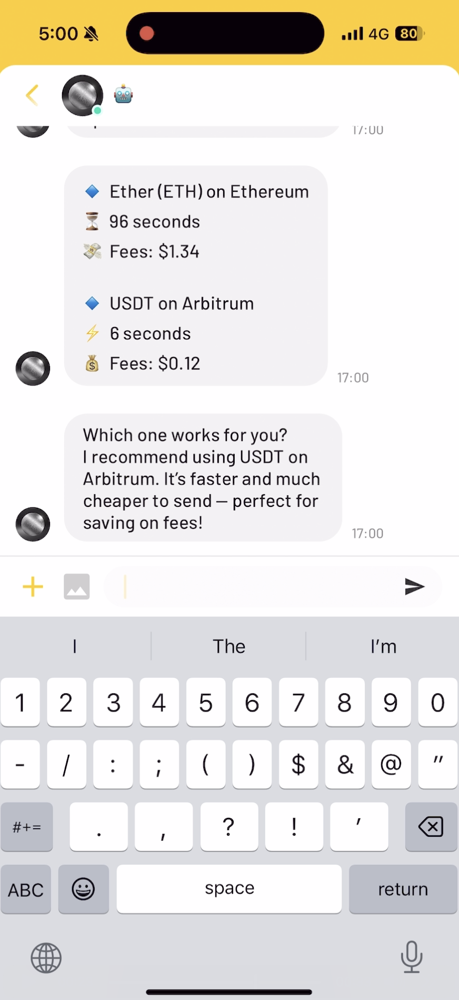
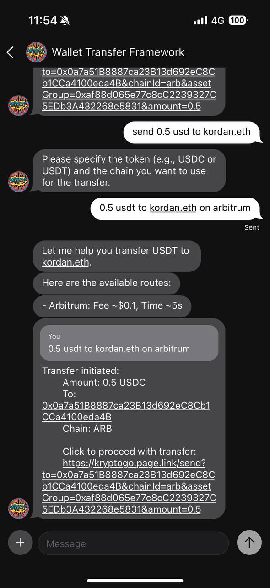
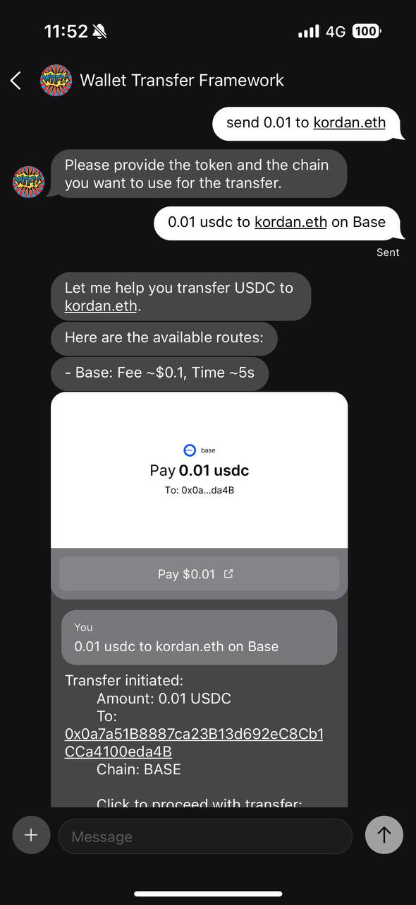
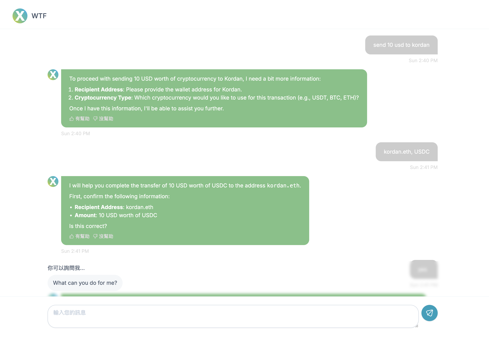

# Wallet Translation Framework (WTF)

## Table of Contents

- [Purpose of WTF](#purpose-of-wtf)
  - [High-Level Architecture](#high-level-architecture)
- [Why Combine WTF with LLM?](#why-combine-wtf-with-llm)
- [Importance of Universal Transfer Operations (UTO)](#importance-of-universal-transfer-operations-uto)
  - [Key Features](#key-features)
  - [UTO Core Operations](#uto-core-operations)
- [Implementations of WTF](#implementations-of-wtf)
  - [1. Flutter Implementation](#1-flutter-implementation)
  - [2. XMTP and MessageKit Implementation](#2-xmtp-and-messagekit-implementation)
  - [3. MomentX Integration](#3-momentx-integration)
  - [4. NounsDAO Integration](#4-nounsdao-integration)
- [Development Setup](#development-setup)
- [Extensibility and Future Directions](#extensibility-and-future-directions)
  - [Future Work](#future-work)

The **Wallet Translation Framework (WTF)** is an innovative AI-driven platform that simplifies cryptocurrency transactions through natural language processing (NLP). By combining AI with Universal Transfer Operations (UTO) and seamless integration into blockchain wallets, WTF redefines how users interact with blockchain technology.
## Purpose of WTF

The primary goal of WTF is to provide a natural, user-friendly interface for managing blockchain-based transactions. The framework combines AI-driven processing with cross-chain stablecoin transfer capabilities to reduce complexity and increase accessibility for end-users and developers.

### High-Level Architecture

```
+-------------------+       +--------------------+       +-------------------+
| User Interface    |       | AI Parsing Engine |       | Wallet Operations |
| (Flutter App)     |       | (WTF SDK)         |       | (Custom Impl.)    |
+-------------------+       +--------------------+       +-------------------+
        |                           |                          |
        | Natural Language Input    |                          |
        +-------------------------> |                          |
        |                           |                          |
        |                           | +---------------------+  |
        |                           | |      AI Model       |  |
        |                           | +---------------------+  |
        |                           |        |                 |
        |                           | Parses Input             |
        |                           +----------------------->  |
        |                           |                          |
        |                           | Converts to UTO          |
        |                           +----------------------->  |
        |                           |                          |
        |                           | Wallet Operation Call    |
        +----------------------------------------------------> |
        |                           |                          |
        |        Result             |                          |
        +<--------------------------+                          |
        |                                                      |
        +----------------------------------------------------> |
```

## Why Combine WTF with LLM?

1. **Enhanced Usability**:
   - Leverages AI-powered natural language processing (NLP) to convert casual language into actionable commands.
   - Example: "Send 100 USDC to Alice" → `/transfer 100 USDC alice.eth Base`

2. **Cross-Chain Interoperability**:
   - Supports Base and Arbitrum networks, enabling seamless transfers of stablecoins like USDC.
   - Unified abstraction for multi-chain operations.

3. **Optimized Execution**:
   - AI models provide intelligent suggestions for transaction routing, balancing speed, cost, and efficiency.

4. **Developer Efficiency**:
   - Reduces the complexity of integrating multi-chain functionalities into wallet applications.

## Importance of Universal Transfer Operations (UTO)

UTO establishes a standardized interface for executing blockchain payment and transfer operations. This abstraction enhances cross-chain interoperability and simplifies integration across diverse blockchain systems.

### Key Features:
- **Cross-Chain Abstraction**: A unified layer compatible with multiple blockchain architectures.
- **AI-Driven Workflow**: Transforms natural language inputs into structured wallet operations.
- **Plug-and-Play Integration**: Simplifies wallet implementation for developers.

### UTO Core Operations:
| Operation            | Description                                                                 |
|-----------------------|-----------------------------------------------------------------------------|
| `create_transfer`     | Initializes a transfer request.                                             |
| `validate_transfer`   | Verifies transfer details like balances and compatibility.                  |
| `get_transfer_options`| Provides route options based on chains, tokens, and fees.                  |
| `execute_transfer`    | Executes the transfer using the chosen route.                              |
| `confirm_transfer`    | Confirms the successful completion of the transfer.                        |

## Implementations of WTF

WTF is implemented through two main approaches: **Flutter** and **XMTP**.

### 1. Flutter Implementation

#### Overview:
The Flutter implementation of WTF leverages the SDK to enable seamless integration into mobile applications, allowing developers to build intuitive interfaces for blockchain transactions. It implements the Universal Transfer Operations (UTO) standard for consistent cross-chain functionality.

```
+-------------------+       +----------------------+       +-------------------+
| Flutter UI        |       | WTF SDK              |       | WalletOperations  |
| - User Input      |       | - AI Processing      |       | Interface         |
| - Status Display  |       | - Command Parser     |       |                   |
+-------------------+       +----------------------+       +-------------------+
        |                           |                              |
        | "Send 100 USDC"           |                              |
        +-------------------------> |                              |
        |                           |                              |
        |                           | 1. createTransfer            |
        |                           +----------------------------> |
        |                           |                              |
        |                           | 2. validateTransfer          |
        |                           +----------------------------> |
        |                           |                              |
        |                           | 3. getTransferOptions        |
        |                           +----------------------------> |
        |                           |                              |
        |                           | 4. executeTransfer           |
        |                           +----------------------------> |
        |                           |                              |
        |                           | 5. confirmTransfer           |
        |                           +----------------------------> |
        |                           |                              
        |     Status Updates        |                              
        | <-------------------------+                             
```

#### Key Features:
- **Modular Design**: 
  - Developers only need to implement essential UTO interfaces
  - Standardized implementation patterns for blockchain operations
  - Clean separation between UI, business logic, and blockchain operations

- **Rapid Scalability**: 
  - Supports Base and Arbitrum networks out of the box
  - Extensible architecture for adding new chains
  - Unified interface for multi-chain operations

- **Seamless AI Integration**: 
  - Natural language processing for command interpretation
  - Intelligent routing based on gas fees and network conditions
  - Flexible prompt system for command processing

#### Workflow:
1. **Interface Definition**:
   - Implements core UTO operations through standardized interfaces
   - Provides type-safe request/response models
   - Handles cross-chain compatibility

2. **Implementation in Flutter**:
   - Developers implement WalletOperations interface
   - Support for both synchronous and asynchronous operations
   - Built-in error handling and validation

3. **AI Integration**:
   - Converts natural language to structured commands
   - Validates input parameters and chain compatibility
   - Provides intelligent suggestions for optimal routes

4. **Execution and Feedback**:
   - Real-time transaction status updates
   - Detailed error reporting
   - Transaction confirmation handling

#### Core Interface:
```dart
abstract class WalletOperations {
  // Initialize transfer request with validation
  Future<TransactionResult> createTransfer(CreateTransferRequest request);
  
  // Execute the validated transfer
  Future<TransactionResult> executeTransfer(TransferExecutionRequest request);
  
  // Get available transfer routes with fees
  Future<List<TransferOption>> getTransferOptions(CreateTransferRequest request);
  
  // Confirm transaction completion
  Future<ConfirmationResult> confirmTransfer(String transactionHash);
}
```

#### Testing:
Basic test setup requires:

1. Environment configuration:
```
OPENAI_API_KEY=your_openai_api_key
```

2. Running tests:
```bash
flutter pub get
flutter test test/basic/main_test.dart
```

#### Demo Videos and Screenshots

Here are screenshots demonstrating how WTF seamlessly integrates with Flutter for building intuitive blockchain wallet interfaces.

<p float="left">
  <video src="assets/flutter_demo.mp4" width="33%" controls></video>
  
  
</p>

### 2. XMTP and MessageKit Implementation

#### Overview:
This implementation uses the XMTP protocol for decentralized messaging combined with MessageKit to enable cross-chain stablecoin transfers via AI. The system processes natural language commands through a sophisticated prompt system and executes transfers via TxPay and KryptoGO integration.

```
+-------------------+       +----------------------+       +-------------------+
| XMTP Client       |       | WTF SDK              |       | Wallet Operations |
| - MessageKit UI   |       | - AI Processing      |       | - TxPay           |
| - Command Input   |       | - Command Parser     |       | - KryptoGO        |
+-------------------+       +----------------------+       +-------------------+
        |                           |                              |
        | "Send 100 USDC to Alice"  |                              |
        +-------------------------> |                              |
        |                           |                              |
        |                           | 1. Parse Natural Language    |
        |                           | +--------------------+       |
        |                           | | AI Prompt System   |       |
        |                           | | - Command Analysis |       |
        |                           | - Parameter Extract  |       |
        |                           | +--------------------+       |
        |                           |                              |
        |                           | 2. Validate Parameters       |
        |                           | - Address Format             |
        |                           | - ENS Resolution             |
        |                           | - Token Compatibility        |
        |                           |                              |
        |                           | 3. Route Selection           |
        |                           +----------------------------> |
        |                           |                              |
        |                           | 4. Fee Estimation            |
        |                           +----------------------------> |
        |                           |                              |
        |                           | 5. Execute Transfer          |
        |                           +----------------------------> |
        |                           |                              
        |     Transaction URL       |                              
        | <-------------------------+                              
        |                           |                              
        |     Status & Fees         |                              
        | <-------------------------+                              
        |                           |                              
        |     Alternative Routes    |                              
        | <-------------------------+                              
```

#### Key Features:
- **AI-Driven Messaging**:
  - Utilizes NLP for processing transfer commands in decentralized messaging
  - Implements a comprehensive prompt system for command interpretation
  - Supports both direct commands and natural language inputs
  
- **Cross-Chain Support**:
  - Facilitates USDC transfers on Arbitrum (0xA0b86991c6218b36c1d19D4a2e9Eb0cE3606eB48)
  - Supports Base and Arbitrum network (0x833589fcd6edb6e08f4c7c32d4f71b54bda02913)
  - Smart routing based on gas fees and confirmation times
  
- **User-Friendly Interface**:
  - Supports ENS domain resolution for human-readable addresses
  - Provides detailed transaction feedback including fees and confirmation times
  - Handles both balance checks and transfers through unified commands

#### Supported Commands:
1. Balance Check:
   ```
   /balance [token] [chain]
   Example: /balance USDC Base
   ```

2. Transfer:
   ```
   /transfer [amount] [token] [recipientAddress] [chain]
   Example: /transfer 100 USDC alice.eth Base
   ```

#### Technical Implementation:
1. **Message Processing**:
   - Implements XMTP's MessageKit for handling user inputs
   - Uses structured handler pattern for command processing
   - Supports both direct commands and AI-interpreted natural language

2. **Transaction Execution**:
   - Integrates with TxPay for transaction execution
   - Supports multiple chain configurations
   - Implements automatic fee estimation and route optimization

3. **Error Handling**:
   - Validates chain support and token compatibility
   - Verifies address formats and ENS resolution
   - Provides clear error messages for failed operations

#### Example Workflow:
1. **User Input**:
   - User sends a message: "Send 100 USDC to Alice"
   
2. **AI Processing**:
   - System processes input through AI prompt system
   - Converts natural language to structured command
   - Validates parameters and chain support
   
3. **Transaction Execution**:
   - Generates transaction URL with appropriate parameters
   - Routes transaction through optimal chain based on fees
   - Executes transfer via TxPay or KryptoGO integration
   
4. **Response Handling**:
   - Provides transaction details and confirmation URL
   - Shows estimated fees and processing time
   - Offers alternative routes if available

#### Demo Videos and Screenshots

Here are screenshots demonstrating the MessageKit integration and user experience:

<p float="left">
  <video src="assets/messagekit_demo.mp4" width="33%" controls></video>
  
  
</p>

### 3. MomentX Integration

#### Overview
WTF demonstrates its versatility by being implemented on the **MomentX** platform, a leader in Metaverse as a Service (MaaS). MomentX enables creators, businesses, and brands to construct unique metaverse environments while integrating Web3, AI, Virtual Humans, and XR technologies.

Here is the demo: https://chat.momentx.ai/publish/WTF%20Wallet-db6e5d838165d206

#### Use Case: Enhancing AI Virtual Assistants with Blockchain Capabilities

MomentX recently launched **Guide-X**, an AI Virtual Assistant designed to provide human-like conversational skills and 24/7 multilingual support. By integrating WTF, Guide-X now incorporates blockchain-enabled functionalities, such as:

1. **Seamless Cryptocurrency Transactions**:
   - Guide-X users can initiate natural language commands like, "Transfer 50 USDC to Alex," and WTF translates these into blockchain-compatible wallet operations.

2. **Cross-Chain Payment Support**:
   - WTF empowers Guide-X to facilitate payments on **Base** and **Arbitrum**, leveraging Layer 2 solutions for cost-effective and fast transactions.

3. **Decentralized Identity Integration**:
   - Through ENS and XMTP, Guide-X can handle secure identity verification and decentralized messaging, ensuring privacy and trust in user interactions.

#### Why This Matters

By incorporating WTF, MomentX extends the capabilities of Guide-X into Web3 and blockchain ecosystems, enabling businesses to:
- Accept cryptocurrency payments directly within the metaverse
- Utilize decentralized identity solutions for secure interactions
- Provide users with a seamless, AI-driven payment experience that is multilingual and available around the clock

#### Demo Videos and Screenshots

Here are screenshots demonstrating the integration and user experience:



### 4. NounsDAO Integration

#### Overview
WTF integrates seamlessly into a chatbot application built on the **NounsDAO** ecosystem, leveraging Nouns' community-owned art and decentralized governance model to create an engaging and functional user experience.

#### Use Case: Nouns-Powered Chatbot with Blockchain Capabilities

The Nouns chatbot app combines the playful, creative spirit of Nouns art with the technical capabilities of WTF to provide users with a unique Web3-enabled experience:

1. **Nouns Art as UI Elements**:
   - Nouns characters and assets are integral to the app's design, used as avatars for the chatbot, interactive icons for wallet operations, and visual branding throughout the interface
   - Each transaction or query is accompanied by Nouns-themed animations, adding a delightful and engaging layer to the user experience

2. **Blockchain-Enabled Functionality via WTF**:
   - Users can initiate wallet operations through natural language commands like "Send 10 USDC to Bob," seamlessly processed by WTF
   - WTF supports cross-chain payments on Base and Arbitrum, ensuring fast, gas-efficient transactions

3. **Community Engagement**:
   - The chatbot connects users to NounsDAO governance tools, allowing them to vote on proposals or allocate funds directly through intuitive commands
   - Users can explore other Nouns projects via the chatbot, deepening community involvement

#### Demo Videos and Screenshots

Here are screenshots demonstrating the integration and user experience:

<p float="left">
  <video src="assets/noun_demo.mp4" width="100%" controls></video>
</p>


By combining Nouns art and governance with WTF's AI-powered wallet operations, this project showcases how Web3 technology can be made more accessible, creative, and community-driven.

### Development Setup

Requirements:
- **Node.js**: Version 20 or higher.
- **TypeScript**: For type safety.
- **Bun**: As a package manager.
- **ESM Modules**: For modular architecture.

How to Get Started:
1. Clone the repository.
2. Install dependencies using Bun:
   ```bash
   bun install
   ```
3. Run the project:
   ```bash
   bun start
   ```

## Extensibility and Future Directions

WTF is designed with extensibility in mind, making it adaptable for future blockchain and AI advancements.

### Future Work:
1. **WalletConnect Integration**:
   - Extend WTF as an official WalletConnect extension.
2. **Multilingual AI**:
   - Support additional languages for a global audience.
3. **Predictive Analytics**:
   - Incorporate gas fee optimization and transaction forecasting.
4. **Expanded Blockchain Support**:
   - Strengthen compatibility with emerging blockchain architectures.
   - Currently supports: **Base**, **Arbitrum**

## License

This project is licensed under the MIT License. See the [LICENSE](https://www.notion.so/kryptogo/LICENSE) file for details.

## Made with ❤️ by
[MessageKit](https://messagekit.ephemerahq.com), [XMTP](https://xmtp.org), and [Converse](https://converse.xyz/dm/wtfagent.converse.xyz).